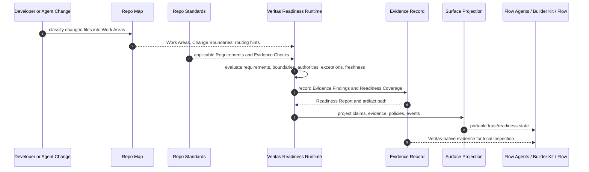
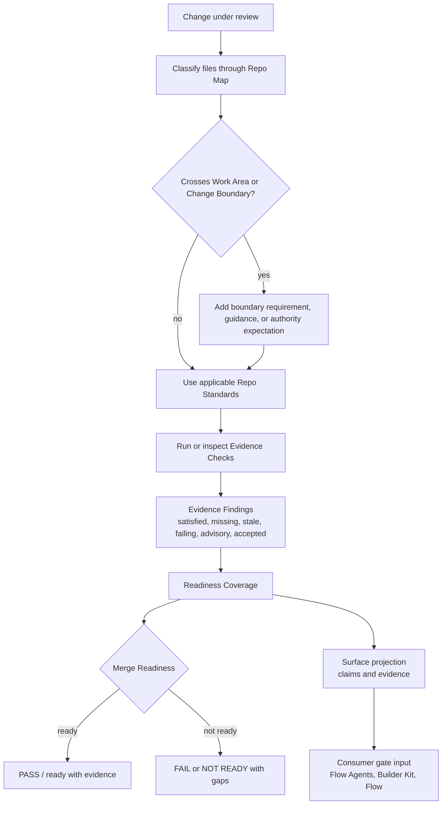

# Developer Architecture

This guide is the Veritas-local map for maintainers and integrators who need to understand how repo governance evidence moves through Veritas and into adjacent Kontour systems. It is docs-only: it does not implement Builder Kit integration, change readiness semantics, migrate schemas, or alter runtime governance behavior.

Use this page when you need the architecture in Veritas vocabulary first. For exact terms, see the [Glossary](../reference/glossary.md). For current artifact fields, see [Artifacts and Schemas](../reference/artifacts-and-schemas.md). For the Surface boundary, see [Surface-Veritas Boundary](surface-veritas-boundary.md) and [Veritas and Surface](../veritas-and-surface.md). For Resource Contract migration direction, see [Resource Contract Audit](../resource-contract-audit.md).

## Scope And Non-Goals

**Current implementation:** Veritas owns repo-native governance and readiness evidence. It evaluates Repo Standards against a change, uses the Repo Map to understand Work Areas and Change Boundaries, records Evidence and Evidence Findings, and emits Readiness Reports that can include a Surface projection.

**Future Resource Contract alignment:** future slices may wrap durable Veritas records in Resource Contract shapes with `apiVersion`, `kind`, `metadata`, `spec`, `status`, and `status.conditions[]`. This guide only describes that direction; it does not change current schemas, CLI output, or generated artifact semantics.

Non-goals for this guide:

- implementing Flow, Flow Agents, Builder Kit, or Surface behavior
- changing merge readiness, readiness coverage, or boundary evaluation rules
- migrating Repo Standards, Repo Maps, Evidence, or Readiness Reports to Resource Contracts
- replacing the existing glossary, schema reference, or Surface boundary contract

## Product And Layer Relationship

Veritas is the **evaluation engine**: a standalone, importable library whose frozen engine API is
the `@kontourai/veritas/engine` subpath (the package root `@kontourai/veritas` resolves to it),
plus thin CLIs (`veritas readiness`/`explain`/`init`). It starts from repo-local governance intent
and produces evidence-backed readiness state. The repo-installed **product surface** it once
shipped — init scaffold, hook setup, standards authoring, just-in-time agent guidance — is owned by
the flow-agents **Veritas Governance Kit** (`kits/veritas-governance`), which wraps the engine via
CLI + artifacts and reimplements no evaluation; see the [Engine / Surface Seam](engine-surface-seam.md).
Surface is the portable transparency projection. Flow, Flow Agents, and Builder Kit consume
readiness or trust state as inputs; they do not own Veritas evaluation semantics.

```mermaid
flowchart LR
  subgraph Veritas["Veritas: repo governance and readiness"]
    RS["Repo Standards\nrequirements and enforcement levels"]
    RM["Repo Map\nWork Areas, Change Boundaries, evidence routing"]
    REQ["Requirement evaluation"]
    EV["Evidence and Evidence Findings"]
    RR["Readiness Report\nMerge Readiness and Readiness Coverage"]
    RS --> REQ
    RM --> REQ
    REQ --> EV
    EV --> RR
  end

  subgraph Surface["Surface: portable transparency"]
    SI["Surface TrustBundle\nclaims, evidence, policies, events"]
    TR["Trust Report / Trust Snapshot"]
    SI --> TR
  end

  subgraph Consumers["Consumers and workflow coordinators"]
    FA["Flow Agents\nlocal agent workflow coordination"]
    BK["Builder Kit\nbuild flow and pickup gates"]
    FL["Flow\nFlow Definition and gate semantics"]
  end

  RR -->|"Built with Surface projection"| SI
  RR -->|"readiness artifact path and verdict"| FA
  TR -->|"portable trust state"| FA
  FA --> BK
  BK -->|"gate input, not Veritas runtime ownership"| FL
  TR -->|"trust/readiness claims"| FL
```

**Current implementation:** Veritas can be used without starting Flow Agents or Builder Kit. The stable Veritas integration artifact is the readiness output, including the `reportArtifactPath` from `veritas readiness --format json` and the generated evidence record described in [Artifacts and Schemas](../reference/artifacts-and-schemas.md).

**Future Resource Contract alignment:** Flow or Builder Kit may consume Resource-shaped Veritas records rather than current Veritas-native JSON when Resource Contract migration slices land. That alignment must preserve ownership: Veritas remains the source of repo governance evidence, and Flow remains the owner of gate/process semantics.

## Ownership Boundaries

| System | Owns | Does not own |
| --- | --- | --- |
| Veritas | Repo Standards, Repo Maps, Work Areas, Change Boundaries, Requirements, Evidence Checks, Evidence, Evidence Findings, Merge Readiness, Readiness Coverage, Readiness Reports, repo conformance, standards feedback, and standards recommendations | Flow gate semantics, Builder Kit workflow state, generic trust report semantics, or cross-product workflow orchestration |
| Surface | Portable claims, evidence, policies, events, authority trace, freshness, conflicts, transparency gaps, trust reports, and trust snapshots | Repo-native concepts such as Work Areas, Boundary Crossings, or Merge Readiness rules |
| Flow | Flow Definition steps, transitions, gates, process semantics, and workflow acceptance rules | Veritas readiness runtime internals or repo standards evaluation |
| Flow Agents | Local agent workflow coordination and consumption of evidence for planning, verification, release, and learning workflows | Veritas schemas, readiness semantics, or Surface trust generation |
| Builder Kit | Product build flow and gate consumption for shaped work | Veritas evidence production, Surface projection, or Flow Definition ownership |

The Surface boundary is one-way: Veritas may produce Surface-compatible trust state, but downstream systems should query Surface/readiness claims rather than import Veritas runtime modules. The detailed Veritas-to-Surface mapping lives in [Surface-Veritas Boundary](surface-veritas-boundary.md).

## Evidence And Readiness Lifecycle

The lifecycle below shows how Veritas turns repo intent and a concrete change into readiness evidence that other systems can inspect.

**Current implementation:** Repo Map and Repo Standards are Veritas-native artifacts. Evidence records are generated under repo-local Veritas paths and remain inspectable without requiring Surface, Flow, Flow Agents, or Builder Kit to run.

**Future Resource Contract alignment:** Repo Maps and Repo Standards are candidates for `spec` because they describe desired governance intent. Readiness Reports and Evidence records are candidates for `status` because they describe observed facts. Evidence should stay separately inspectable rather than being hidden inside metadata.

## Governance Evidence Role

Veritas' governance evidence role is to make a readiness decision explainable: what requirement applied, what evidence was present or missing, whether the evidence was fresh, and whether an authority accepted an exception.

**Current implementation:** Veritas decides readiness from applicable Requirements, evidence, authority, exceptions, and freshness. Surface projection makes that state portable, but the Veritas meaning remains merge readiness.

**Future Resource Contract alignment:** a future Readiness Report resource can expose conditions such as `Ready`, `EvidenceFresh`, `BoundaryCrossing`, `ExceptionAccepted`, and `SurfaceProjected`. That is a migration plan, not current behavior in this issue.

## Local Concepts In The Flow

Repo Map:
: The repo-local model of Work Areas, Change Boundaries, Protected Areas, ownership context, dependency relationships, and evidence routing. Current schema details are in [Artifacts and Schemas](../reference/artifacts-and-schemas.md#repo-map-schema).

Work Area:
: A meaningful part of the repo with purpose and change expectations. Work Areas help Veritas explain why a file matters for a change.

Change Boundary:
: A coordination or risk threshold around a Work Area. Crossing a boundary can add evidence, guidance, authority, or coordination requirements.

Requirement:
: A condition from Repo Standards that must be satisfied, evidenced, or accepted by exception.

Evidence and Evidence Finding:
: Evidence is a traceable result, observation, artifact, attestation, or record. Evidence Findings explain the observed state for a Requirement, such as satisfied, missing, stale, failing, advisory, recheckable, or accepted by exception.

Readiness Report:
: The generated report that explains Merge Readiness and Readiness Coverage for a change. The current artifact shapes are documented in [Artifacts and Schemas](../reference/artifacts-and-schemas.md).

Surface projection:
: The Built with Surface projection that turns Veritas readiness and evidence into portable claims, evidence, policies, and events. Surface owns the generic trust model; Veritas owns the repo governance meaning.

Flow Agents, Builder Kit, and Flow gates:
: Consumers can use Veritas evidence and Surface trust state as inputs for planning, verification, build, or release gates. They must not treat Veritas runtime internals as their integration contract.

## Reading The Architecture Locally

Start here, then follow only the references needed for the question:

1. Use the [Glossary](../reference/glossary.md) for canonical Veritas terms.
2. Use [Artifacts and Schemas](../reference/artifacts-and-schemas.md) for current generated paths and schema details.
3. Use [Surface-Veritas Boundary](surface-veritas-boundary.md) and [Veritas and Surface](../veritas-and-surface.md) for projection rules.
4. Use [Engine / Surface Seam](engine-surface-seam.md) for the engine-library vs product-surface split, the frozen engine API, and where each capability lives (engine vs the flow-agents Governance Kit).
5. Use [Resource Contract Audit](../resource-contract-audit.md) only for future migration planning.

If an architecture statement says **Current implementation**, it describes behavior or artifacts that exist now. If it says **Future Resource Contract alignment**, it describes a planned direction that needs its own implementation, validation, and compatibility review.
